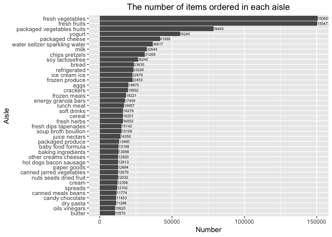

p8105\_hw3\_xj2249
================
xj2249
2019/10/3

# Problem1

## 1\) Short description of the dataset

``` r
library(p8105.datasets)
library(tidyverse)
library(kableExtra) 
data("instacart")
# skimr::skim(instacart)
instacart %>% 
  filter(user_id == "21") %>% 
  kable(caption = "Purchase info of user '21' ") 
```

<table>

<caption>

Purchase info of user ‘21’

</caption>

<thead>

<tr>

<th style="text-align:right;">

order\_id

</th>

<th style="text-align:right;">

product\_id

</th>

<th style="text-align:right;">

add\_to\_cart\_order

</th>

<th style="text-align:right;">

reordered

</th>

<th style="text-align:right;">

user\_id

</th>

<th style="text-align:left;">

eval\_set

</th>

<th style="text-align:right;">

order\_number

</th>

<th style="text-align:right;">

order\_dow

</th>

<th style="text-align:right;">

order\_hour\_of\_day

</th>

<th style="text-align:right;">

days\_since\_prior\_order

</th>

<th style="text-align:left;">

product\_name

</th>

<th style="text-align:right;">

aisle\_id

</th>

<th style="text-align:right;">

department\_id

</th>

<th style="text-align:left;">

aisle

</th>

<th style="text-align:left;">

department

</th>

</tr>

</thead>

<tbody>

<tr>

<td style="text-align:right;">

1854765

</td>

<td style="text-align:right;">

25740

</td>

<td style="text-align:right;">

1

</td>

<td style="text-align:right;">

1

</td>

<td style="text-align:right;">

21

</td>

<td style="text-align:left;">

train

</td>

<td style="text-align:right;">

34

</td>

<td style="text-align:right;">

1

</td>

<td style="text-align:right;">

12

</td>

<td style="text-align:right;">

28

</td>

<td style="text-align:left;">

Pepperidge Farm® Goldfish Xtra Cheddar Baked Snack Crackers

</td>

<td style="text-align:right;">

78

</td>

<td style="text-align:right;">

19

</td>

<td style="text-align:left;">

crackers

</td>

<td style="text-align:left;">

snacks

</td>

</tr>

<tr>

<td style="text-align:right;">

1854765

</td>

<td style="text-align:right;">

12683

</td>

<td style="text-align:right;">

2

</td>

<td style="text-align:right;">

1

</td>

<td style="text-align:right;">

21

</td>

<td style="text-align:left;">

train

</td>

<td style="text-align:right;">

34

</td>

<td style="text-align:right;">

1

</td>

<td style="text-align:right;">

12

</td>

<td style="text-align:right;">

28

</td>

<td style="text-align:left;">

Dry Roasted 100 Calorie Packs Almonds

</td>

<td style="text-align:right;">

117

</td>

<td style="text-align:right;">

19

</td>

<td style="text-align:left;">

nuts seeds dried fruit

</td>

<td style="text-align:left;">

snacks

</td>

</tr>

<tr>

<td style="text-align:right;">

1854765

</td>

<td style="text-align:right;">

44632

</td>

<td style="text-align:right;">

3

</td>

<td style="text-align:right;">

1

</td>

<td style="text-align:right;">

21

</td>

<td style="text-align:left;">

train

</td>

<td style="text-align:right;">

34

</td>

<td style="text-align:right;">

1

</td>

<td style="text-align:right;">

12

</td>

<td style="text-align:right;">

28

</td>

<td style="text-align:left;">

Sparkling Water Grapefruit

</td>

<td style="text-align:right;">

115

</td>

<td style="text-align:right;">

7

</td>

<td style="text-align:left;">

water seltzer sparkling water

</td>

<td style="text-align:left;">

beverages

</td>

</tr>

<tr>

<td style="text-align:right;">

1854765

</td>

<td style="text-align:right;">

10957

</td>

<td style="text-align:right;">

4

</td>

<td style="text-align:right;">

1

</td>

<td style="text-align:right;">

21

</td>

<td style="text-align:left;">

train

</td>

<td style="text-align:right;">

34

</td>

<td style="text-align:right;">

1

</td>

<td style="text-align:right;">

12

</td>

<td style="text-align:right;">

28

</td>

<td style="text-align:left;">

Fridge Pack Cola

</td>

<td style="text-align:right;">

77

</td>

<td style="text-align:right;">

7

</td>

<td style="text-align:left;">

soft drinks

</td>

<td style="text-align:left;">

beverages

</td>

</tr>

<tr>

<td style="text-align:right;">

1854765

</td>

<td style="text-align:right;">

32645

</td>

<td style="text-align:right;">

5

</td>

<td style="text-align:right;">

1

</td>

<td style="text-align:right;">

21

</td>

<td style="text-align:left;">

train

</td>

<td style="text-align:right;">

34

</td>

<td style="text-align:right;">

1

</td>

<td style="text-align:right;">

12

</td>

<td style="text-align:right;">

28

</td>

<td style="text-align:left;">

Sugarfree Energy Drink

</td>

<td style="text-align:right;">

64

</td>

<td style="text-align:right;">

7

</td>

<td style="text-align:left;">

energy sports drinks

</td>

<td style="text-align:left;">

beverages

</td>

</tr>

<tr>

<td style="text-align:right;">

1854765

</td>

<td style="text-align:right;">

16615

</td>

<td style="text-align:right;">

6

</td>

<td style="text-align:right;">

0

</td>

<td style="text-align:right;">

21

</td>

<td style="text-align:left;">

train

</td>

<td style="text-align:right;">

34

</td>

<td style="text-align:right;">

1

</td>

<td style="text-align:right;">

12

</td>

<td style="text-align:right;">

28

</td>

<td style="text-align:left;">

Zero Calories Berry Nutrient Enhanced Water

</td>

<td style="text-align:right;">

64

</td>

<td style="text-align:right;">

7

</td>

<td style="text-align:left;">

energy sports drinks

</td>

<td style="text-align:left;">

beverages

</td>

</tr>

</tbody>

</table>

  - Size and structure: The “instacart” dataset has a 1384617, 15
    dimensions, namely 1384617 observations and 15 variables, of which
    four are character variables and others are numeric variables.
  - Key variables: `order_id`, `product_name`, `user_id`, `order_dow`,
    `order_hour_of_day`, `aisle`, etc.
  - Example: As showed in the table, for the customer with a `use_id` of
    21, each row represents a product ordered by him/her at midday
    Monday. And mainly products were ordered from beverages and snacks
    departments.

## 2\) Number of aisles and the most ordered one

``` r
# number of aisles
instacart %>% 
        dplyr::distinct(aisle_id) %>% 
        nrow()

# find aisles are the most items ordered from.
instacart %>% 
  count(aisle) %>% 
  top_n(1,n)
```

There are **134** aisles and **“fresh vegetables”** aisle is the top
aisle that the most items were ordered from, with 150609 orders.

## 3\) A plot that shows the number of items ordered in each aisle

``` r
instacart %>% 
        group_by(aisle) %>% 
        summarise(n = n()) %>% 
        filter( n > 10000) %>% 
        ggplot(aes(x = fct_reorder(aisle,n), y = n)) +
        geom_col() +
        labs( title = "The number of items ordered in each aisle", 
              x = "Aisle" , 
              y = "Number") +
        coord_flip() +
        theme(plot.title = element_text(hjust = 0.5)) +
        geom_text(aes(label = n),size = 2,hjust = 0) 
```

<!-- -->

As the plot shows, fresh vegetables, fresh fruits and packaged vegetable
fruits rank top 3. Well, people really love vegetables and fruits\! COOL
AND HEALTHY\!

## 4\) A table of three most popular items

``` r
instacart %>% 
        filter(aisle %in% c("baking ingredients",
                            "dog food care",
                            "packaged vegetables fruits")) %>% 
        group_by(aisle,product_name) %>% 
        summarise(n = n()) %>% 
        arrange(desc(n)) %>% 
        top_n(3) %>% 
        kable(caption = "Three most popular items",
              col.names = c("Aisles","Product","Number"))
```

    ## Selecting by n

<table>

<caption>

Three most popular items

</caption>

<thead>

<tr>

<th style="text-align:left;">

Aisles

</th>

<th style="text-align:left;">

Product

</th>

<th style="text-align:right;">

Number

</th>

</tr>

</thead>

<tbody>

<tr>

<td style="text-align:left;">

packaged vegetables fruits

</td>

<td style="text-align:left;">

Organic Baby Spinach

</td>

<td style="text-align:right;">

9784

</td>

</tr>

<tr>

<td style="text-align:left;">

packaged vegetables fruits

</td>

<td style="text-align:left;">

Organic Raspberries

</td>

<td style="text-align:right;">

5546

</td>

</tr>

<tr>

<td style="text-align:left;">

packaged vegetables fruits

</td>

<td style="text-align:left;">

Organic Blueberries

</td>

<td style="text-align:right;">

4966

</td>

</tr>

<tr>

<td style="text-align:left;">

baking ingredients

</td>

<td style="text-align:left;">

Light Brown Sugar

</td>

<td style="text-align:right;">

499

</td>

</tr>

<tr>

<td style="text-align:left;">

baking ingredients

</td>

<td style="text-align:left;">

Pure Baking Soda

</td>

<td style="text-align:right;">

387

</td>

</tr>

<tr>

<td style="text-align:left;">

baking ingredients

</td>

<td style="text-align:left;">

Cane Sugar

</td>

<td style="text-align:right;">

336

</td>

</tr>

<tr>

<td style="text-align:left;">

dog food care

</td>

<td style="text-align:left;">

Snack Sticks Chicken & Rice Recipe Dog Treats

</td>

<td style="text-align:right;">

30

</td>

</tr>

<tr>

<td style="text-align:left;">

dog food care

</td>

<td style="text-align:left;">

Organix Chicken & Brown Rice Recipe

</td>

<td style="text-align:right;">

28

</td>

</tr>

<tr>

<td style="text-align:left;">

dog food care

</td>

<td style="text-align:left;">

Small Dog
Biscuits

</td>

<td style="text-align:right;">

26

</td>

</tr>

</tbody>

</table>

## 5\) Mean hour of the day at which Pink Lady Apples and Coffee Ice Cream are ordered

``` r
instacart %>% 
        filter(product_name %in% c("Pink Lady Apples",
                                   "Coffee Ice Cream")) %>% 
        group_by(order_dow,product_name) %>% 
        summarise(mean = mean(order_hour_of_day)) %>% 
        pivot_wider(
                names_from = order_dow,
                values_from = mean
                ) %>% 
        rename("Sunday" = '0',
               "Monday" = '1',
               "Tuesday" = '2',
               "Wednesday" = '3',
               "Thursday" = '4',
               "Friday" = '5',
               "Saturday" = '6') %>% 
        kable(caption = "Mean hour of the day when products are ordered in a week",digits = 0)
```

<table>

<caption>

Mean hour of the day when products are ordered in a week

</caption>

<thead>

<tr>

<th style="text-align:left;">

product\_name

</th>

<th style="text-align:right;">

Sunday

</th>

<th style="text-align:right;">

Monday

</th>

<th style="text-align:right;">

Tuesday

</th>

<th style="text-align:right;">

Wednesday

</th>

<th style="text-align:right;">

Thursday

</th>

<th style="text-align:right;">

Friday

</th>

<th style="text-align:right;">

Saturday

</th>

</tr>

</thead>

<tbody>

<tr>

<td style="text-align:left;">

Coffee Ice Cream

</td>

<td style="text-align:right;">

14

</td>

<td style="text-align:right;">

14

</td>

<td style="text-align:right;">

15

</td>

<td style="text-align:right;">

15

</td>

<td style="text-align:right;">

15

</td>

<td style="text-align:right;">

12

</td>

<td style="text-align:right;">

14

</td>

</tr>

<tr>

<td style="text-align:left;">

Pink Lady Apples

</td>

<td style="text-align:right;">

13

</td>

<td style="text-align:right;">

11

</td>

<td style="text-align:right;">

12

</td>

<td style="text-align:right;">

14

</td>

<td style="text-align:right;">

12

</td>

<td style="text-align:right;">

13

</td>

<td style="text-align:right;">

12

</td>

</tr>

</tbody>

</table>

As we can see, Pink Lady Apples and Coffee Ice Cream are mainly ordered
during the midday.

# Problem2:

## 1\) let’s do some data cleaning\!

``` r
data("brfss_smart2010") 
brfss_health <-
  brfss_smart2010 %>% 
  janitor::clean_names() %>% 
  rename( states = locationabbr,
          locations = locationdesc) %>% 
  filter( topic == "Overall Health") %>% 
  filter( response %in% c("Poor","Fair","Good","Very good","Excellent")) %>% 
  mutate( response = factor(response, levels = c("Poor","Fair","Good","Very good","Excellent")))
```

## 2\) States that were observed at 7 or more locations

``` r
brfss_health %>% 
  filter(year %in% c(2002,2010)) %>% 
  group_by(year,states) %>% 
  summarise(n = n_distinct(locations)) %>% 
  filter(n >= 7) %>% 
  arrange(year,n) %>% 
  t() %>% 
  kable(caption = "States observed at 7 or more locations")  
```

<table>

<caption>

States observed at 7 or more locations

</caption>

<tbody>

<tr>

<td style="text-align:left;">

year

</td>

<td style="text-align:left;">

2002

</td>

<td style="text-align:left;">

2002

</td>

<td style="text-align:left;">

2002

</td>

<td style="text-align:left;">

2002

</td>

<td style="text-align:left;">

2002

</td>

<td style="text-align:left;">

2002

</td>

<td style="text-align:left;">

2010

</td>

<td style="text-align:left;">

2010

</td>

<td style="text-align:left;">

2010

</td>

<td style="text-align:left;">

2010

</td>

<td style="text-align:left;">

2010

</td>

<td style="text-align:left;">

2010

</td>

<td style="text-align:left;">

2010

</td>

<td style="text-align:left;">

2010

</td>

<td style="text-align:left;">

2010

</td>

<td style="text-align:left;">

2010

</td>

<td style="text-align:left;">

2010

</td>

<td style="text-align:left;">

2010

</td>

<td style="text-align:left;">

2010

</td>

<td style="text-align:left;">

2010

</td>

</tr>

<tr>

<td style="text-align:left;">

states

</td>

<td style="text-align:left;">

CT

</td>

<td style="text-align:left;">

FL

</td>

<td style="text-align:left;">

NC

</td>

<td style="text-align:left;">

MA

</td>

<td style="text-align:left;">

NJ

</td>

<td style="text-align:left;">

PA

</td>

<td style="text-align:left;">

CO

</td>

<td style="text-align:left;">

PA

</td>

<td style="text-align:left;">

SC

</td>

<td style="text-align:left;">

OH

</td>

<td style="text-align:left;">

MA

</td>

<td style="text-align:left;">

NY

</td>

<td style="text-align:left;">

NE

</td>

<td style="text-align:left;">

WA

</td>

<td style="text-align:left;">

CA

</td>

<td style="text-align:left;">

MD

</td>

<td style="text-align:left;">

NC

</td>

<td style="text-align:left;">

TX

</td>

<td style="text-align:left;">

NJ

</td>

<td style="text-align:left;">

FL

</td>

</tr>

<tr>

<td style="text-align:left;">

n

</td>

<td style="text-align:left;">

7

</td>

<td style="text-align:left;">

7

</td>

<td style="text-align:left;">

7

</td>

<td style="text-align:left;">

8

</td>

<td style="text-align:left;">

8

</td>

<td style="text-align:left;">

10

</td>

<td style="text-align:left;">

7

</td>

<td style="text-align:left;">

7

</td>

<td style="text-align:left;">

7

</td>

<td style="text-align:left;">

8

</td>

<td style="text-align:left;">

9

</td>

<td style="text-align:left;">

9

</td>

<td style="text-align:left;">

10

</td>

<td style="text-align:left;">

10

</td>

<td style="text-align:left;">

12

</td>

<td style="text-align:left;">

12

</td>

<td style="text-align:left;">

12

</td>

<td style="text-align:left;">

16

</td>

<td style="text-align:left;">

19

</td>

<td style="text-align:left;">

41

</td>

</tr>

</tbody>

</table>

In 2002, CT, FL, NC, MA, NJ and PA were observed at 7 or more
locations.  
In 2010, CO, PA, SC, OH, MA, NY, NE, WA, CA, MD, NC, TX, NJ and FL were
observed at 7 or more locations.

## 3\) Only “Excellent” dataset & “spaghetti” plot.

``` r
brfss_excel <- 
  brfss_health %>% 
  filter(response == "Excellent") %>% 
  group_by(states,year) %>% 
  summarise( mean = mean(data_value,na.rm = TRUE))  

brfss_excel %>% 
  ggplot(aes(x = year , y = mean, color = states )) +
  geom_line() + 
  labs(x = "Year", 
       y = "Average value", 
       title = "Average value over time within a state") +
  scale_color_hue( name = "State") + 
  theme(plot.title = element_text(hjust = 0.5))
```

<!-- -->

Wow, too many lines going on here. Seems most states experienced ups and
downs from 2002 to 2010.

## 4\) Two-panel plot

``` r
brfss_health %>% 
        filter(year %in% c(2006,2010) & states == "NY") %>% 
        ggplot(aes( x = response, y = data_value ,color = locations )) + 
        geom_point(size = 0.5) +
        geom_line(aes(group =  locations), alpha = 0.5) +
        facet_grid(cols = vars(year)) + 
        labs(y = "data value", title = "Distribution of data_value for responses in NY" ) +
        facet_grid(cols = vars(year)) +
        theme(axis.text.x = element_text(angle = 45, hjust = 1),plot.title = element_text(hjust = 0.5))
```

<!-- -->

``` r
brfss_health %>% 
        filter(year %in% c(2006,2010) & states == "NY") %>% 
        ggplot(aes( x = locations , y = data_value ,color = response )) + 
        geom_point(size = 0.5) +
        geom_line(aes(group =  response) , alpha = 0.5) +
        facet_grid(cols = vars(year)) + 
        labs(y = "data value", title = "Distribution of data_value for responses in NY" ) +
        theme(axis.text.x = element_text(angle = 45, hjust = 1),plot.title = element_text(hjust = 0.5))
```

<!-- -->

Try to see it in two ways so I made two plots. Both plots shows that
even in the same response group, the `data_value` varies among different
locations. And “Poor” responses correspond two the lowest `data_value`.

# Problem3

## 1\) Load, tidy, and wrangle data

``` r
accel <- 
        read_csv("./data/accel_data.csv") %>% 
        janitor::clean_names() %>% 
        pivot_longer(
                cols = starts_with("activity"),
                names_to = "activity_min",
                values_to = "count",
                names_prefix = "activity."
                ) %>% 
        mutate(weekday_vs_weekend = case_when( day == "Saturday" ~ "weekend",
                                                day == "Sunday" ~ "weekend",
                                                TRUE ~ "weekday"),
                day = factor(day, levels = c("Monday","Tuesday","Wednesday","Thursday","Friday","Saturday","Sunday"))
               ) %>% 
        arrange(week,day)
```

The resulting dataset has 50400 observations and 6variables, including
`week`, `day_id`, `day`, `activity_min`, `count` and
`weekday_vs_weekend`.

## 2\) Total activity table

``` r
accel %>% 
  group_by(week,day) %>% 
  summarise( total_activity = sum(count)) %>% 
  t() %>% 
  kable(caption = "Total activity of each day") 
```

<table>

<caption>

Total activity of each day

</caption>

<tbody>

<tr>

<td style="text-align:left;">

week

</td>

<td style="text-align:left;">

1

</td>

<td style="text-align:left;">

1

</td>

<td style="text-align:left;">

1

</td>

<td style="text-align:left;">

1

</td>

<td style="text-align:left;">

1

</td>

<td style="text-align:left;">

1

</td>

<td style="text-align:left;">

1

</td>

<td style="text-align:left;">

2

</td>

<td style="text-align:left;">

2

</td>

<td style="text-align:left;">

2

</td>

<td style="text-align:left;">

2

</td>

<td style="text-align:left;">

2

</td>

<td style="text-align:left;">

2

</td>

<td style="text-align:left;">

2

</td>

<td style="text-align:left;">

3

</td>

<td style="text-align:left;">

3

</td>

<td style="text-align:left;">

3

</td>

<td style="text-align:left;">

3

</td>

<td style="text-align:left;">

3

</td>

<td style="text-align:left;">

3

</td>

<td style="text-align:left;">

3

</td>

<td style="text-align:left;">

4

</td>

<td style="text-align:left;">

4

</td>

<td style="text-align:left;">

4

</td>

<td style="text-align:left;">

4

</td>

<td style="text-align:left;">

4

</td>

<td style="text-align:left;">

4

</td>

<td style="text-align:left;">

4

</td>

<td style="text-align:left;">

5

</td>

<td style="text-align:left;">

5

</td>

<td style="text-align:left;">

5

</td>

<td style="text-align:left;">

5

</td>

<td style="text-align:left;">

5

</td>

<td style="text-align:left;">

5

</td>

<td style="text-align:left;">

5

</td>

</tr>

<tr>

<td style="text-align:left;">

day

</td>

<td style="text-align:left;">

Monday

</td>

<td style="text-align:left;">

Tuesday

</td>

<td style="text-align:left;">

Wednesday

</td>

<td style="text-align:left;">

Thursday

</td>

<td style="text-align:left;">

Friday

</td>

<td style="text-align:left;">

Saturday

</td>

<td style="text-align:left;">

Sunday

</td>

<td style="text-align:left;">

Monday

</td>

<td style="text-align:left;">

Tuesday

</td>

<td style="text-align:left;">

Wednesday

</td>

<td style="text-align:left;">

Thursday

</td>

<td style="text-align:left;">

Friday

</td>

<td style="text-align:left;">

Saturday

</td>

<td style="text-align:left;">

Sunday

</td>

<td style="text-align:left;">

Monday

</td>

<td style="text-align:left;">

Tuesday

</td>

<td style="text-align:left;">

Wednesday

</td>

<td style="text-align:left;">

Thursday

</td>

<td style="text-align:left;">

Friday

</td>

<td style="text-align:left;">

Saturday

</td>

<td style="text-align:left;">

Sunday

</td>

<td style="text-align:left;">

Monday

</td>

<td style="text-align:left;">

Tuesday

</td>

<td style="text-align:left;">

Wednesday

</td>

<td style="text-align:left;">

Thursday

</td>

<td style="text-align:left;">

Friday

</td>

<td style="text-align:left;">

Saturday

</td>

<td style="text-align:left;">

Sunday

</td>

<td style="text-align:left;">

Monday

</td>

<td style="text-align:left;">

Tuesday

</td>

<td style="text-align:left;">

Wednesday

</td>

<td style="text-align:left;">

Thursday

</td>

<td style="text-align:left;">

Friday

</td>

<td style="text-align:left;">

Saturday

</td>

<td style="text-align:left;">

Sunday

</td>

</tr>

<tr>

<td style="text-align:left;">

total\_activity

</td>

<td style="text-align:left;">

78828.07

</td>

<td style="text-align:left;">

307094.24

</td>

<td style="text-align:left;">

340115.01

</td>

<td style="text-align:left;">

355923.64

</td>

<td style="text-align:left;">

480542.62

</td>

<td style="text-align:left;">

376254.00

</td>

<td style="text-align:left;">

631105.00

</td>

<td style="text-align:left;">

295431.00

</td>

<td style="text-align:left;">

423245.00

</td>

<td style="text-align:left;">

440962.00

</td>

<td style="text-align:left;">

474048.00

</td>

<td style="text-align:left;">

568839.00

</td>

<td style="text-align:left;">

607175.00

</td>

<td style="text-align:left;">

422018.00

</td>

<td style="text-align:left;">

685910.00

</td>

<td style="text-align:left;">

381507.00

</td>

<td style="text-align:left;">

468869.00

</td>

<td style="text-align:left;">

371230.00

</td>

<td style="text-align:left;">

467420.00

</td>

<td style="text-align:left;">

382928.00

</td>

<td style="text-align:left;">

467052.00

</td>

<td style="text-align:left;">

409450.00

</td>

<td style="text-align:left;">

319568.00

</td>

<td style="text-align:left;">

434460.00

</td>

<td style="text-align:left;">

340291.00

</td>

<td style="text-align:left;">

154049.00

</td>

<td style="text-align:left;">

1440.00

</td>

<td style="text-align:left;">

260617.00

</td>

<td style="text-align:left;">

389080.00

</td>

<td style="text-align:left;">

367824.00

</td>

<td style="text-align:left;">

445366.00

</td>

<td style="text-align:left;">

549658.00

</td>

<td style="text-align:left;">

620860.00

</td>

<td style="text-align:left;">

1440.00

</td>

<td style="text-align:left;">

138421.00

</td>

</tr>

</tbody>

</table>

Since it’s really hard to see trends in a table, let’s make a dotplot.

``` r
accel %>% 
  group_by(week,day) %>% 
  summarise( total_activity = sum(count)) %>% 
  ungroup() %>% 
  mutate(day_id = 1:35) %>% 
  ggplot(aes(x = day_id, y = total_activity, color = day)) +
  geom_point()
```

<!-- -->

As the plot shows, there is no apparent trend here.(As for me\!)

## 3\) 24-hour activity

``` r
accel %>% 
  ggplot(aes(x = as.numeric(activity_min), y = count, color = day )) +
  geom_point(alpha = 0.21, size = 1) +
  geom_line(alpha = 0.21) +
  scale_x_continuous(breaks = seq(60,60*24,60), 
                   labels = as.character(c(1:24))) +
  labs(x = "Time in a day (hour)",
       y = "Activity count",
       title = "24-hour activity course of each day") + 
  theme_minimal() +
  theme(legend.title = element_blank(), 
        legend.position = "bottom",
        plot.title = element_text(hjust = 0.5)) 
```

<!-- -->

REALLY REALLY…TOO MANY DOTS AND LINES\! Basically, the 63 year-old
male’s activity started to increase from around 6 am (he may just get
up at this time) and several activity peaks can be seen around midday,
5pm and 21pm. After 22pm, the activity goes down again.(Time to sleep\!)
